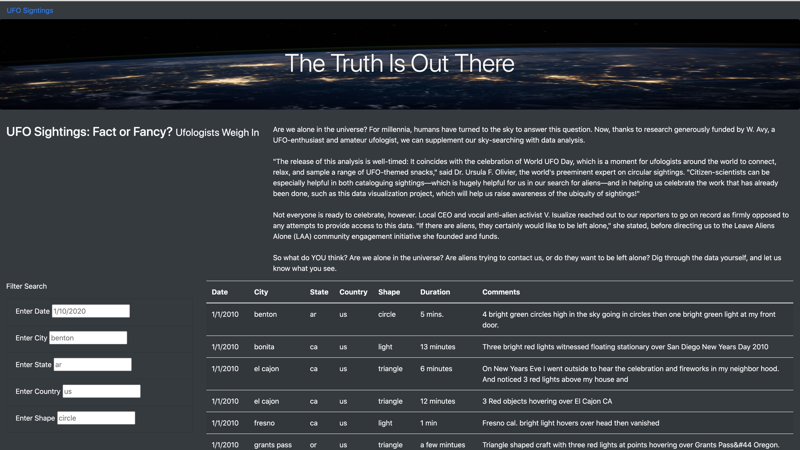
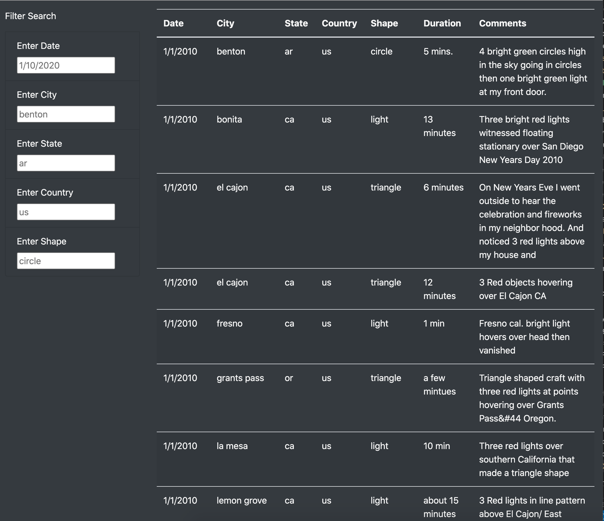
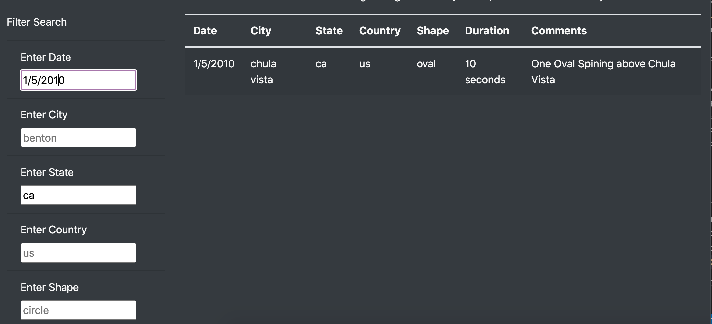

# UFOs

## Overview of Project:
The purpose of this project is to create a webpage to display UFO sighting information that allows the user to filter multiple criteria at the same time.  The dynamic table will filter by date, city, state, country and shape of the UFO sightings.  For this project, Javascript, HTML, bootstrap and CSS stylesheets were used to create the webpage and dynamic table filters.

UFO webpage:

## Results: 

If you are an enthusiast for UFO sightings, you can easily search the data on this webpage by date, city, state, country and shape of the UFO.  On the left hand side of the webpage, there's a Filter Search panel to enter the criteria of interest. 

UFO search fields, unfiltered:

As an example, you can filter by date and state to display the details of the specific UFO sighting event.

UFO filtered by date and state:

## Summary: 

By adding more fields as Filter, it allows multiple criteria to narrow down the search.  One drawback to multiple criteria added is that the user may not be aware of the limitation to the data set.  Adding multiple filters will narrow down the search too much and no data will display.  This webpage's dynamic table currently holds data from 1/1/2010 - 1/13/2010 only.

For further development of this project, two considerations:
1. Rather than update the table using a static data.js file, find the source site to update the data via webscraping.
2. Add a "Reset" button to update the data easily for multiple search sessions.